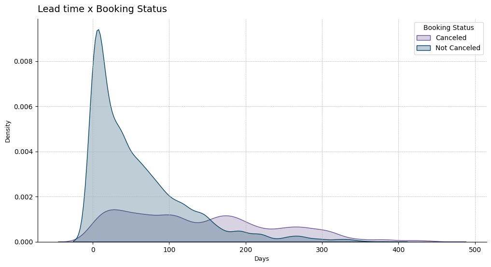

# Booking Status Prediction - Hotel Reservations Dataset


#### Content
- [Introduction](#-introduction)
- [Tools](#-tools)
- [Dataset](#-dataset)
- [Results](#-results)
  - [Exploratory Data Analysis](#exploratory-data-analysis)
  - [Model Metrics](#model-metrics)
- [How to Use](#️-how-to-use)
- [License](#-license)
- [Contact](#-contact)

## 📝 Introduction 
### New Channels, New Problems
The possibility of making reservations online has completely changed consumer behavior. A large number of reservations are canceled very close to the date or simply result in *no-shows* (when the customer does not show up). Typical reasons for this include changes in plans, scheduling conflicts, etc., which have become increasingly common due to options like canceling reservations without penalties or with a very low cost. This is beneficial for travelers but detrimental to the hotel's revenue.

### Goals and Objectives
- **Objectives:** The main objective of this project is to investigate factors related to cancellations and *no-shows* and to build a machine learning model capable of predicting the probability of these situations occurring.
- **Goals:** (1) Obtain insights from the data to reduce no-shows and identify solutions, (2) build a binary classification model capable of predicting no-shows, and (3) create a *web* application for attendance prediction.

## 🛠️ Tools 
- **Python 3.12+**
- **Libraries**:
  - pandas
  - numpy
  - matplotlib
  - seaborn
  - lightgbm
  - scikit-learn
  - caregory-encoders
  - feature-engine
  - optuna

## 📊 Dataset

|Feature|Description|
|---|---|
|``Booking_ID``|Unique identifier of the booking|
|``no_of_adults``|Number of adults|
|``no_of_children``|Number of children|
|``no_of_weekend_nights``|Number of nights during the weekend|
|``no_of_week_nights``|Number of nights during the week|
|``type_of_meal_plan``|Selected meal package|
|``required_car_parking_space``|Flag indicating if the customer needs a parking space|
|``room_type_reserved``|Type of room reserved|
|``lead_time``|Days between booking and arrival at the hotel|
|``arrival_year``|Year of arrival|
|``arrival_month``|Month of arrival|
|``arrival_date``|Date of arrival|
|``market_segment``|Market segment|
|``repeated_guest``|Flag indicating if the customer has made previous bookings|
|``no_of_previous_cancellations``|Number of cancellations before the current booking|
|``no_of_previous_bookings_not_canceled``|Number of previous bookings not canceled before the current booking|
|``avg_price_per_room``|Average booking price (prices are dynamic)|
|``no_of_special_requests``|Number of special requests made by the customer (e.g., sea view, specific floor)|
|``booking_status``|Target variable, flag indicating if the booking was canceled or not|

Original data can be found in [Kaggle](https://www.kaggle.com/datasets/ahsan81/hotel-reservations-classification-dataset).

## ✅ Results
### Exploratory Data Analysis
#### Descriptive Analysis
- Only 3% of customers request a parking space;
- On average, bookings are made 85 days in advance; the median suggests a possible imbalance in the distribution of this feature (we will examine this feature visually);
- Only 2% of customers are repeat guests, indicating potential to further explore this group;
- 32% of customers cancel their bookings.

#### Target Behavior


#### Hypothesis Testing
##### Lead Time vs. Cancellations
Bookings made well in advance may have a higher probability of cancellation. Trips are always susceptible to changes in plans and unforeseen events. Let's work on this hypothesis:

- $H_0:$ Lead time does not significantly affect cancellations.
- $H_1:$ A longer lead time increases the probability of cancellation.

We reject $H_0$: **A longer lead time increases the probability of cancellation.**

Bookings made between 150 and 300 days prior to the arrival date have a higher probability of cancellation. It is advisable to create alerts and confirmations for bookings starting from the 100-day mark.



##### Average Price per Room vs. Cancellations

Since room prices are dynamic, seeing a better offer or realizing a suboptimal choice may lead to cancellations, so a higher-priced room may have a higher probability of cancellation.

- $H_0:$ The average price per room has no significant effect on the probability of cancellation.
- $H_1:$ A higher average price per room is associated with a higher probability of cancellation.

We reject $H_0$: **A higher average price per room is associated with a higher probability of cancellation.**


##### Number of Children vs. Cancellations

A higher number of children makes travel planning more challenging, as children tend to get sick more often, among other potential unforeseen events.

- $H_0:$ The number of children does not have a significant effect on cancellations.
- $H_1:$ A higher number of children increases the probability of cancellation.

We reject $H_0$: A higher number of children increases the probability of cancellation.


##### Room Type vs. Cancellation

Room type may also be related to cancellations, and testing this hypothesis could highlight areas for service improvement.

- $H_0:$ Room type is independent of booking status.
- $H_1:$ Room type is not independent of booking status.

We reject $H_0$: Room Type and Booking Status are related.


Types 1 and 4 have the most reservations; however, while Type 1 has a low cancellation rate, Type 4 has more cancellations than successful bookings, warranting deeper investigation. Type 6 has the highest proportional cancellation rate, which is another key point to consider.

##### Market Segment vs. Booking Status

We cannot conclude the hypothesis testing without examining market segments, so let's test:

- $H_0:$ Market segment is independent of booking status.
- $H_1:$ Market segment is not independent of booking status.

We reject $H_0$: Marketing Segment and Booking Status are related.


As expected, the online segment is the most popular and also has the highest cancellation rate. Corporate and Complementary segments have the fewest cancellations.

#### Observing over time


We observe a growth in the cancellation count, with a trend showing that cancellations peak from September to November, further investigation is needed to identify the factors behind this pattern.

#### Conclusions
- Reservations with long lead times need to be closely tracked. Simple actions, such as periodic confirmation messages or emails, can help manage cancellations, as we’ve seen that the probability of cancellation rises with longer lead times.
- A higher number of children increases the probability of cancellation. This should also be tracked, and solutions like basic health support options for children could be considered.
- Rooms of Types 4 and 6 should undergo price revisions and quality improvements to help reduce their high cancellation rates.
- The Online segment is the most popular and has the highest cancellation rate. The Complementary and Corporate segments have the lowest cancellation rates, so rewarding these segments may be beneficial.
- Bookings for September, October, and November require monitoring for external factors that may cause cancellations, such as climate issues and regional events.

### Model metrics
The model has shown no signs of overfitting. It has high accuracy and a low number of false negatives, which could otherwise result in greater revenue losses.

- **Accuracy**: 0.9016.
- **F1 Score**: 0.8468.
- **ROC AUC Score**: 0.9607.


## ⚙️ How to Use
You can make predictions using the [Streamlit](https://booking-status.streamlit.app/) app.

##### Install
```bash
git clone https://github.com/datalopes1/booking_status.git
cd booking_status
poetry install
```
##### Train model
```bash
cd scr
python main.py
```

## 📚 License
This project is licensed under the MIT License - see the LICENSE.md file for details.

## 📞 Contact
- LinkedIn: https://www.linkedin.com/in/andreluizls1
- Portfolio: https://sites.google.com/view/datalopes1
- E-mail: datalopes1@proton.me